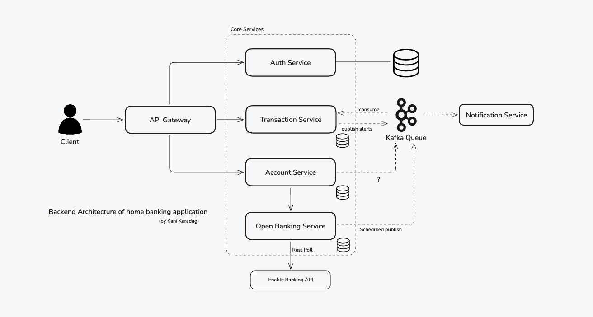
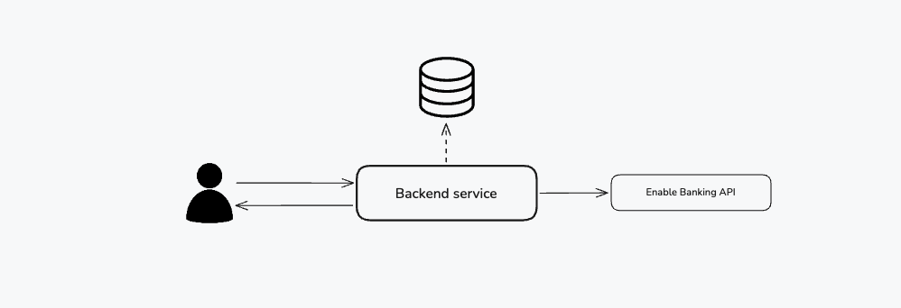

# Real Banking Manager (WIP)

A personal finance management backend that connects to real bank accounts via the Enable Banking Open Banking API. The system performs automated OAuth2 authorization flows with RSA-signed JWT authentication, periodically syncs real transaction data and account balances through a scheduled polling service, and distributes the data across microservices via Apache Kafka. Users can view their transaction history, monitor account balances, and categorize spending — all sourced from their actual bank. Not production-ready yet. Built as a portfolio project to explore microservice architecture and Open Banking integration.

## Microservice Architecture Overview 

## Services

### Open Banking Service

The core integration layer that connects the system to real bank accounts via the [EnableBanking API](https://enablebanking.com).

**Authorization Flow**
- Fetches available banks (ASPSPs) from EnableBanking, optionally filtered by country
- Initiates the OAuth2-like authorization flow and redirects the user to their bank
- Handles the callback, exchanges it for a session, and saves session and account data in PostgreSQL
- Sessions are valid for 90 days

**Scheduled Sync**
- Periodically polls all active bank sessions for transactions and balances
- First sync: fetches the last 90 days of transactions; subsequent syncs: last 1 day
- Publishes `TransactionRawEvent` and `AccountUpdateEvent` to Kafka for downstream services

**JWT Authentication**
- Every EnableBanking API call is authenticated with an RS256-signed JWT
- The private RSA key is loaded from a PEM file at startup

**Kafka Events published**

| Event | Description |
|---|---|
| `AccountUpdateEvent` | Account metadata and current balance — consumed by Account Service |
| `TransactionRawEvent` | Raw transaction data — consumed by Transaction Service |

---

### Account Service

The user-facing service for managing bank account data. It acts as the gateway for the authorization flow and keeps account information up to date via Kafka.

**Authorization Proxy**
- Exposes `GET /api/v1/account/banks` to list available banks (proxied to Open Banking Service)
- Exposes `POST /api/v1/account/auth` to initiate the bank authorization flow (proxied to Open Banking Service)

**Account Management**
- Consumes `AccountUpdateEvent` from Kafka: creates a new account record if it does not exist yet, or updates the balance of an existing one
- Persists account data (IBAN, name, currency, balance, session reference) in PostgreSQL
- Exposes `GET /api/v1/account/accounts` to retrieve account details by ID

**Kafka Events consumed**

| Event | Description |
|---|---|
| `AccountUpdateEvent` | Account metadata and balance update from Open Banking Service |

---

### Transaction Service

Responsible for persisting, querying, and categorizing transaction data received from the Open Banking Service.

**Kafka Consumer**
- Consumes `TransactionRawEvent` from Kafka and persists transactions to PostgreSQL
- Duplicate transactions (identified via `externalId`) are silently ignored via a unique constraint

**Transaction Querying**
- `GET /api/v1/transactions` returns transactions for a user with optional filters: date range, type (credit/debit), and category
- `GET /api/v1/transaction/{id}` returns a single transaction by ID
- Filtering is implemented via JPA Specifications for flexible query composition

**Categorization**
- Users can create, list, and delete custom categories (`GET/POST /api/v1/categories`, `DELETE /api/v1/category/{id}`)
- `PATCH /api/v1/transaction/{id}` assigns a category to a transaction

**Kafka Events consumed**

| Event | Description |
|---|---|
| `TransactionRawEvent` | Raw transaction data from Open Banking Service |

---

## Tech Stack
- Java (Spring Boot)
- Apache Kafka
- PostgreSQL
- Hibernate
- Flyway
- Docker
- JWT
- Spring Cloud Gateway
- ngrok

## Personal note
The backend implementation may be somewhat overengineered at this stage. It could definitely be built much more simpler without many of the components currently in use. However, this is primarily a learning project for myself focusing on fundamentals and getting deeper in topics such as JWT-based authentication, Kafka queues, and communication between microservices. In a prettier world the application could also be structured like this:

