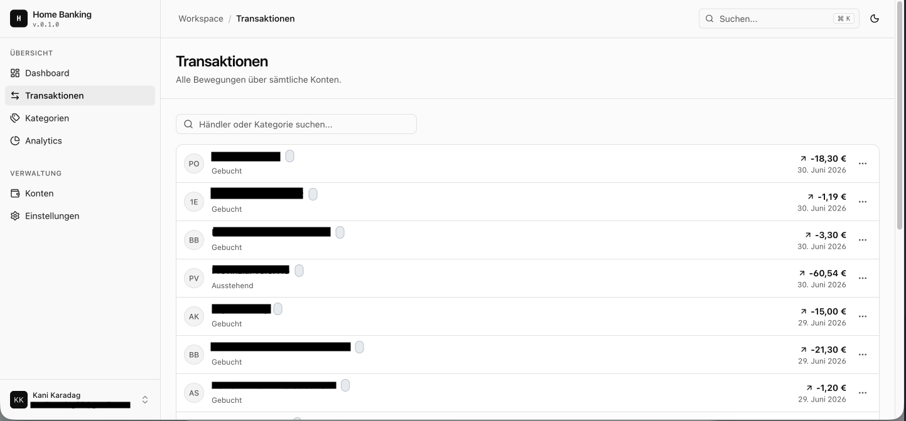

# Real Home Banking Manager (WIP) 
 
  
A full-stack personal finance management application that connects to real bank accounts via the Enable Banking Open Banking API. The backend performs automated OAuth2 authorization flows with RSA-signed JWT authentication, periodically syncs real transaction data and account balances through a scheduled polling service, and distributes the data across microservices via Apache Kafka. A React + TypeScript frontend provides a guided bank onboarding experience, transaction history with filtering and categorization, and account balance monitoring which is all **sourced from the user's actual bank**. Not production-ready yet. Built as a portfolio project to explore microservice architecture, Open Banking integration, and full-stack development. 
 
## Microservice Architecture Overview 
 

 


## Services

### Auth Service
Handles user registration and login. Issues RS256-signed JWTs containing the user ID, which downstream
services use to identify the requesting user.

### API Gateway
Single entry point for all client requests. Validates the JWT on every incoming request and injects the
extracted user ID as an `X-User-Id` header before forwarding to the target service.

### Open Banking Service
Core integration with the EnableBanking API. Manages the OAuth2 bank authorization flow, stores sessions
and account data in PostgreSQL, and runs a scheduled sync that periodically fetches transactions and
balances — publishing them to Kafka for downstream consumption.

### Account Service
Exposes the bank connection endpoints to the frontend (proxied to the Open Banking Service) and keeps
account data up to date by consuming `AccountUpdateEvent` messages from Kafka.

### Transaction Service
Consumes raw transaction events from Kafka and persists them to PostgreSQL. Provides filterable
transaction queries and lets users manage and assign custom spending categories.


## Tech Stack
- Java (Spring Boot)
- Apache Kafka
- PostgreSQL
- Hibernate
- Flyway
- Docker
- JWT
- Spring Cloud Gateway
- ngrok


## Getting Started

  ### Prerequisites
  - Docker & Docker Compose
  - Node.js (for the frontend)
  - An [EnableBanking](https://enablebanking.com) developer account (about to be changed)
  - An [ngrok](https://ngrok.com) account (required for the OAuth2 bank callback — EnableBanking needs a
  public HTTPS URL)


  ### 1. Configure secrets

  Each service reads sensitive config from a `secrets.properties` file under `src/main/resources/keys/`.
  These are not committed.

  **`services/open-banking-service/src/main/resources/keys/secrets.properties`**
  ```properties
  enablebanking.api.application-id=<your-application-id>
  enablebanking.api.private-key-path=classpath:keys/<your-key-file>.pem
  ngrok.authToken=<your-ngrok-auth-token>
  spring.datasource.username=USERNAME
  spring.datasource.password=PASSWORD

  services/auth-service/src/main/resources/keys/secrets.properties
  services/account-service/src/main/resources/keys/secrets.properties
  services/transaction-service/src/main/resources/keys/secrets.properties
  services/api-gateway/src/main/resources/keys/secrets.properties
  spring.datasource.username=USERNAME
  spring.datasource.password=PASSWORD
  ```

  ### 2. Update the redirect URL

  In services/open-banking-service/src/main/resources/application.properties, set the ngrok callback URL to
   your own ngrok domain:

  enablebanking.api.redirect-url=https://<your-ngrok-domain>/api/v1/open-banking/callback


  ### 3. Start the backend

  The Dockerfiles build the Spring Boot services automatically — no local Java or Maven needed.

  cd services
  docker-compose up --build

  This starts PostgreSQL, Zookeeper, Kafka, all five backend services, and a Kafka UI at
  http://localhost:8091.
  The API is accessible via the gateway at http://localhost:8090.

  
  ### 4. Start the frontend

  cd frontend
  npm install
  npm run dev

  The frontend runs at http://localhost:5173.


## Personal note
The backend implementation may be somewhat overengineered at this stage. It could definitely be built much more simpler without many of the components currently in use. However, this is primarily a learning project for myself focusing on fundamentals and getting deeper in topics such as JWT-based authentication, Kafka queues, and communication between microservices. In a happier world the application could also be structured like this:


## Work in progress
This project is still under development and therefore lacks a few features. If you have any feedback or suggestions just reach out to me or open an issue. Also feel free to clone this repo and try it out yourself. Just start the docker compose container and the services and you are good to go!


